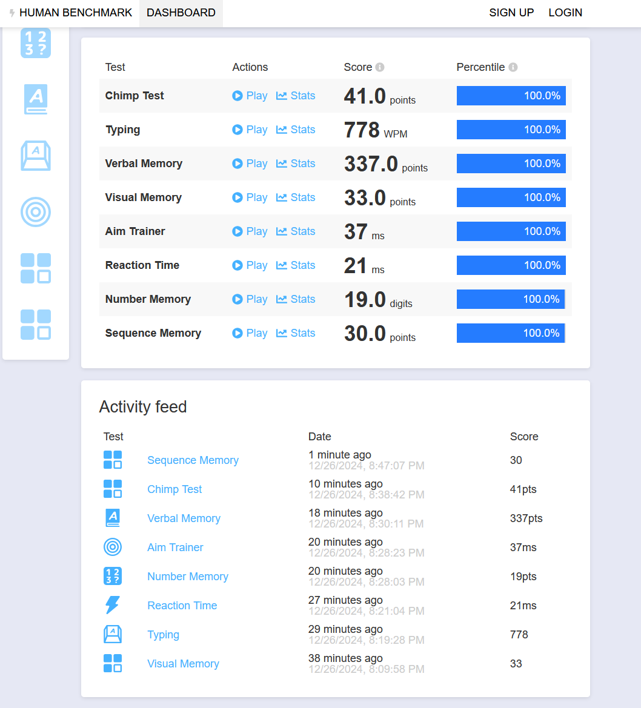

# Human Benchmark Test Solver

This project is a collection of Python scripts designed to solve all tests available on [Human Benchmark](https://humanbenchmark.com/dashboard) with 100% accuracy. Each script corresponds to a specific test on the platform and is optimized to achieve the highest possible score.



## Project Structure

- **verbal_memory.py**: Solves the Verbal Memory test by remembering words and identifying new ones.
- **number_memory.py**: Solves the Number Memory test by recalling increasingly longer sequences of numbers.
- **typing_test.py**: Solves the Typing Test by typing a given passage as quickly and accurately as possible.
- **visual_memory.py**: Solves the Visual Memory test by remembering the location of squares on a grid.
- **reaction_time_test.py**: Solves the Reaction Time test by measuring the time taken to respond to a visual stimulus.
- **aim_trainer_test.py**: Solves the Aim Trainer test by clicking on targets as quickly as possible.
- **chimp_test.py**: Solves the Chimp Test by remembering the location of numbers on a grid.
- **sequence_memory.py**: Solves the Sequence Memory test by recalling increasingly longer sequences of colors.
- **main.py**: The main menu to select and run any of the tests.

## Usage

To run simply run `python main.py` and select the test you want to run. from the menu.

```bash
python main.py
```

Ensure you have [Python](https://www.python.org/downloads/) and [Tesseract](https://github.com/UB-Mannheim/tesseract/wiki) installed on your system to execute these scripts.

## Notes

- The scripts interact with the webpage through mouse movements, clicks, and keyboard inputs - the same way a human would solve these tests. They do not modify the webpage or game code.
- This project is for educational and entertainment purposes only and demonstrates automation of web-based interactions.

## License

MIT License

Copyright (c) [2025] [nandosobral03](https://github.com/nandosobral03)

Permission is hereby granted, free of charge, to any person obtaining a copy
of this software and associated documentation files (the "Software"), to deal
in the Software without restriction, including without limitation the rights
to use, copy, modify, merge, publish, distribute, sublicense, and/or sell
copies of the Software, and to permit persons to whom the Software is
furnished to do so, subject to the following conditions:

The above copyright notice and this permission notice shall be included in all
copies or substantial portions of the Software.

THE SOFTWARE IS PROVIDED "AS IS", WITHOUT WARRANTY OF ANY KIND, EXPRESS OR
IMPLIED, INCLUDING BUT NOT LIMITED TO THE WARRANTIES OF MERCHANTABILITY,
FITNESS FOR A PARTICULAR PURPOSE AND NONINFRINGEMENT. IN NO EVENT SHALL THE
AUTHORS OR COPYRIGHT HOLDERS BE LIABLE FOR ANY CLAIM, DAMAGES OR OTHER
LIABILITY, WHETHER IN AN ACTION OF CONTRACT, TORT OR OTHERWISE, ARISING FROM,
OUT OF OR IN CONNECTION WITH THE SOFTWARE OR THE USE OR OTHER DEALINGS IN THE
SOFTWARE.
